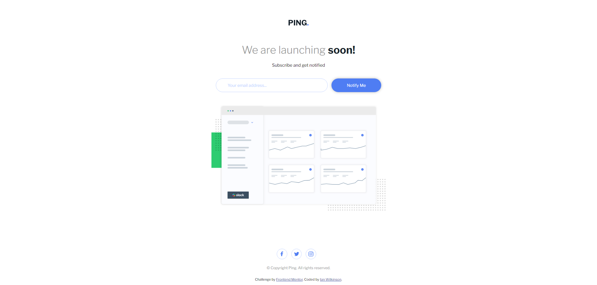
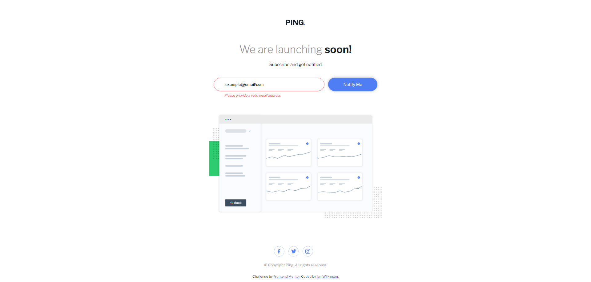
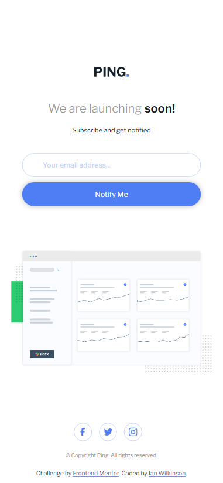

# Frontend Mentor - Ping coming soon page solution

This is a solution to the [Ping coming soon page challenge on Frontend Mentor](https://www.frontendmentor.io/challenges/ping-single-column-coming-soon-page-5cadd051fec04111f7b848da). Frontend Mentor challenges help you improve your coding skills by building realistic projects. 

## Table of contents

- [Overview](#overview)
  - [The challenge](#the-challenge)
  - [Screenshot](#screenshot)
  - [Links](#links)
- [My process](#my-process)
  - [Built with](#built-with)
  - [What I learned](#what-i-learned)
  - [Continued development](#continued-development)
  - [Useful resources](#useful-resources)
- [Author](#author)


## Overview

### The challenge

Users should be able to:

- View the optimal layout for the site depending on their device's screen size
- See hover states for all interactive elements on the page
- Submit their email address using an `input` field
- Receive an error message when the `form` is submitted if:
	- The `input` field is empty. The message for this error should say *"Whoops! It looks like you forgot to add your email"*
	- The email address is not formatted correctly (i.e. a correct email address should have this structure: `name@host.tld`). The message for this error should say *"Please provide a valid email address"*

### Screenshot

Desktop:




Mobile: 



### Links

- [Live Site URL](https://ping-coming-soon-ianwilk20.netlify.app/design/)


## My process

### Built with

- Semantic HTML5 markup
- CSS custom properties
- Flexbox
- Mobile-first workflow

### What I learned

- Previously to implement the social icons at the bottom of the page I would have put an img tag inside of a button tag and added padding and some other styles to make it look nice. I learned a handy trick of using the ```background-image``` css property for displaying an image inside of a button. I found this way was quicker and easier.

- A learning I carried over from the previous challenge I did was the form validation styling. When there is a blank input or an invalid email address and the user clicks "Notify Me", I add styles to a hidden paragraph tag. I leveraged the same thing when a valid email address is submitted, whereby I add a success style to a paragraph tag that reads "Thank you for subscribing to PING's newsletter!" in green.

### Continued development

I'm still getting comfortable with Flexbox and making responsive sites. I'd also like to try using the grid layout in a future challenge to get familiar with that too.

### Useful resources

- [Using images in buttons](https://stackoverflow.com/questions/9576843/using-images-inside-button-element) - This tip taught me a better way to put images in buttons.


## Author

- GitHub - [ianwilk20](https://github.com/ianwilk20)
